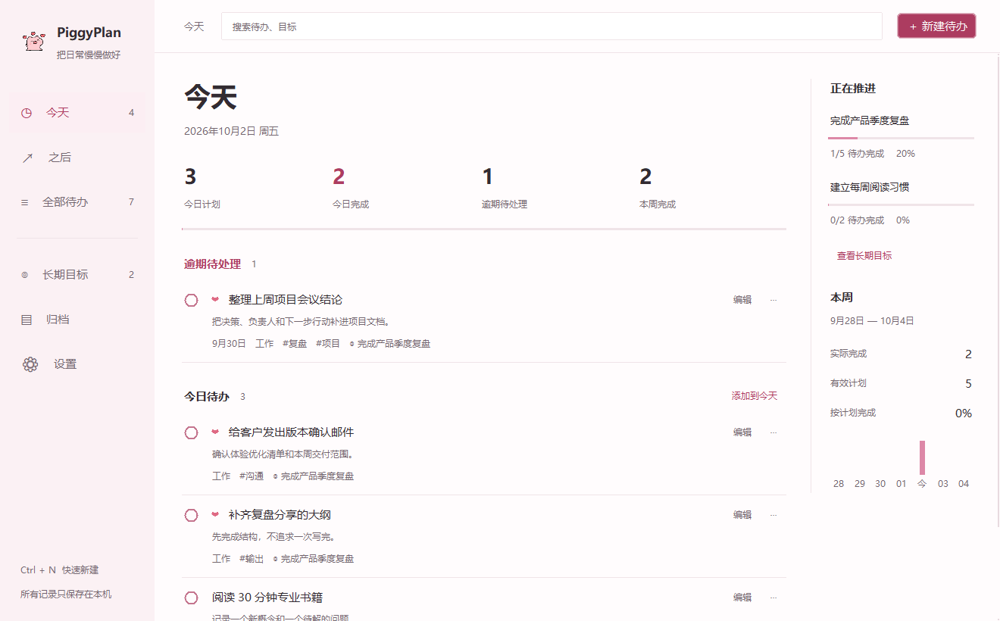

# 日常 · PiggyPlan 1.1.2

PiggyPlan 是一款可在 Windows 本机运行的个人待办与长期目标管理软件。主程序使用原生桌面窗口和 SQLite 数据库，不需要浏览器、账号、网络连接或后台数据库服务。

[项目仓库](https://github.com/zhuerchong888/piggyplan) · [下载 Windows 便携版](https://github.com/zhuerchong888/piggyplan/releases/latest)

下载 ZIP 后完整解压，双击 `PiggyPlan.exe` 即可运行，无需安装 Python。




## 直接启动

双击项目目录中的 `启动 PiggyPlan.bat`，优先启动已验证的便携版；没有成品时使用本机 Python。

已构建的绿色便携版位于 `dist\PiggyPlan`，也可以直接双击其中的
`PiggyPlan.exe`。便携版不需要安装 Python，不需要浏览器，也不会联网。
当前分发包为 `dist/PiggyPlan-Windows-x64-1.1.2.zip`，旁边附 SHA256 校验文件。

也可以在 PowerShell 中运行：

```powershell
python piggyplan_desktop.py
```

源码运行环境为 Windows 10/11 和 Python 3.10+；绿色便携版不需要 Python。
软件仅使用 Python 标准库，不需要执行 `pip install`。

首次启动为空白数据，不会自动写入示例任务。数据库默认保存在：

```text
%APPDATA%\PiggyPlan\piggyplan.db
```

每日快照位于 `%APPDATA%\PiggyPlan\backups`，最近保留 14 份；技术日志位于 `%APPDATA%\PiggyPlan\logs`，日志不记录任务标题或备注。

## 已实现

- 原生 Windows 桌面窗口、SQLite 本地持久化和单实例保护
- 今天 / 之后 / 全部，逾期不自动顺延，未安排不进入计划完成率
- 待办新增、编辑、完成、撤回、删除、右键操作、拖拽排序和批量修改
- 工作 / 学习分类，高 / 普通优先级，日期、标签、子步骤和任务模板
- 精简待办表单：默认只显示标题、分类、计划日期和所属目标；备注、优先级、标签与子步骤按需展开
- 长期目标、自动进度、目标—待办联动、目标达成与恢复
- 列表 / 两栏看板、全局搜索、筛选、待办与目标归档
- 实际完成数量、有效计划、按计划日完成率和最近 7 天图表
- JSON 完整备份与恢复、CSV 历史导出、每日 SQLite 自动快照
- 单一小猪粉主题：暖白内容面、深色正文、玫瑰色操作，连续列表与统一留白；猪形象用于品牌和空状态，心形标记高优先级
- 窗口尺寸记忆、窄窗口隐藏概览栏、看板自动单列、跨午夜刷新与备份
- 系统托盘、关闭到托盘、开机自启和全局快捷添加
- 窗口内快捷键：`Ctrl + N`、`Ctrl + F`、`Ctrl + 1/2/3`

默认全局快捷键为 `Ctrl + Alt + T`。如果它被其他软件占用，设置页会明确显示冲突，可改为例如 `Ctrl + Alt + F12`。

## 验证

```powershell
python -B -m unittest discover -s tests -v
python -B piggyplan_desktop.py --self-test
python -B piggyplan_desktop.py --gui-smoke
```

重建猪形象资产（`assets_src/piggy.png` -> `piggyplan/assets.py` 与 `icon.ico`）与截图夹具：

```powershell
npm run assets
npm run shots
```

最终界面截图覆盖两种窗口尺寸、主要页面与编辑/批量操作弹窗：

```powershell
python -B tools/shoot.py final-wide --geometry=1320x820+60+40
python -B tools/shoot.py final-narrow --geometry=860x680+60+40
```

截图使用临时示例数据库；有效截图会复用，界面修改后先清除对应截图目录再生成。

也可以运行：

```powershell
powershell -ExecutionPolicy Bypass -File .\verify.ps1
```

旧的浏览器/PWA 实现已移入 `legacy/` 保留作界面参考，需要时可用 `npm run web` 启动；正式本地桌面版入口是 `piggyplan_desktop.py`。

## 项目结构

```text
启动 PiggyPlan.bat      双击启动入口
piggyplan_desktop.py    Python 入口（启动脚本、开机自启和打包都引用此文件）
piggyplan/
  app.py               应用窗口与各模块协调
  database.py          SQLite 数据与目标、待办规则
  runtime/             数据目录、Tcl 修复、单实例、托盘与全局热键
  ui/                  基础控件、猪形象、菜单、弹窗与提示
  pages/               今天、之后、全部、目标、归档、搜索与设置
  dialogs/             待办、目标、筛选与快速添加弹窗
  features/            单项与批量操作
  tokens.py assets.py   主题与生成的内嵌素材
  selftest.py           数据库、视觉规则与界面自测
tools/                 素材生成、界面截图与 Windows 截图辅助
tests/                 控件、主题、桌面交互与真实工作流回归
assets_src/            猪形象原始素材
packaging/             打包 hooks 与 Windows 版本信息
docs/
  requirements/        原始需求与完善版需求
  superpowers/         已完成的设计与实施记录
  便携版使用说明.txt    随便携版分发的说明源文件
  项目整理记录.md       清理范围与保留原则
shots/                 before 历史参考与 final-wide/final-narrow 当前界面截图
legacy/                保留作参考的旧浏览器/PWA 实现
dist/PiggyPlan/        当前可运行便携版，须整体保留
.build-tools/          本机 PyInstaller 工具链（已忽略版本控制）
build_exe.py           打包入口
verify.ps1             源码与便携版验证入口
icon.ico               窗口与便携版图标
package.json           可选的 npm 命令快捷入口，无 npm 依赖
```

需求以 [完善版](docs/requirements/个人待办与长期目标管理系统_完善版.md) 为参考，
[原始版](docs/requirements/个人待办与长期目标管理系统.md) 保留作为历史资料。

## 重新打包与目录维护

```powershell
python build_exe.py
```

打包使用 `.build-tools/` 中的 PyInstaller；若工具链不存在，先执行
`python -m pip install --target .build-tools pyinstaller`。构建后运行 `verify.ps1` 验证。
打包中间文件、自动生成的 spec 统一写入 `build/`，可在验证后删除；
Python 的 `__pycache__/` 与 `.pyc` 也可以删除，会在运行时重新生成。

`dist/PiggyPlan/` 是当前成品，`shots/` 保留历史参考与宽、窄窗口最终截图。
旧版 ZIP、根目录临时截图和分阶段截图已清除；历史实施记录中的旧路径保留原样，
当前路径以本 README 为准。项目目录中不保存正式用户数据库。

## 本次改进

统一了导航、页头、任务与目标列表、设置表单和弹窗；旧主题设置与备份自动迁移为粉色。
新建与编辑待办默认显示核心字段，“更多选项”展开补充信息，收起或只修改标题不会丢失已有详情。
全应用分类改为“工作 / 学习”，旧“生活”记录和备份仍可读取并显示为“学习”。
编辑子步骤在保存时才生效，重排保留完成状态，同名目标可准确选择；归档搜索可连续输入，
全局搜索可打开目标详情，目标看板不受“全部”页筛选影响。“今天”的数量只包含当日与逾期未完成事项。
备份恢复在覆盖前校验嵌套数据并保留快照，CSV 保留完整自然日；滚轮、键盘焦点与长表单操作已完善。
删除目标下未来待办会取消尚未到期的计划，今天及逾期计划保留；目标操作失败时整体回滚。
